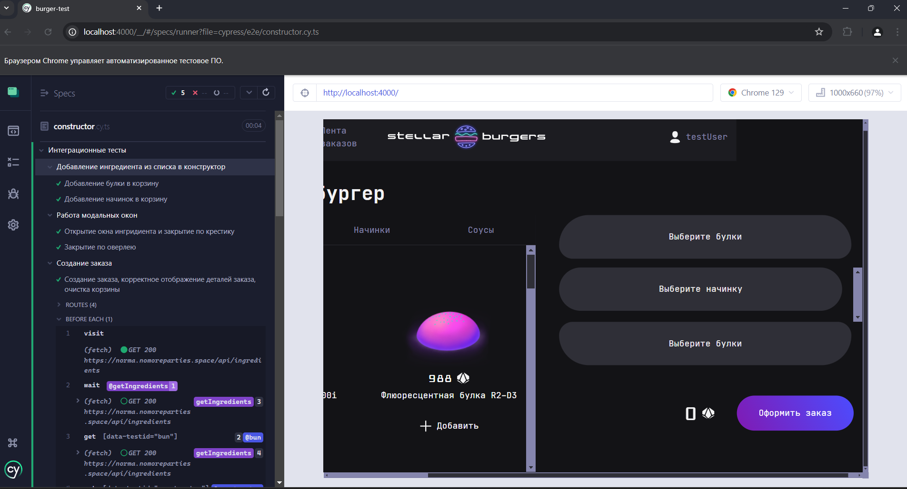
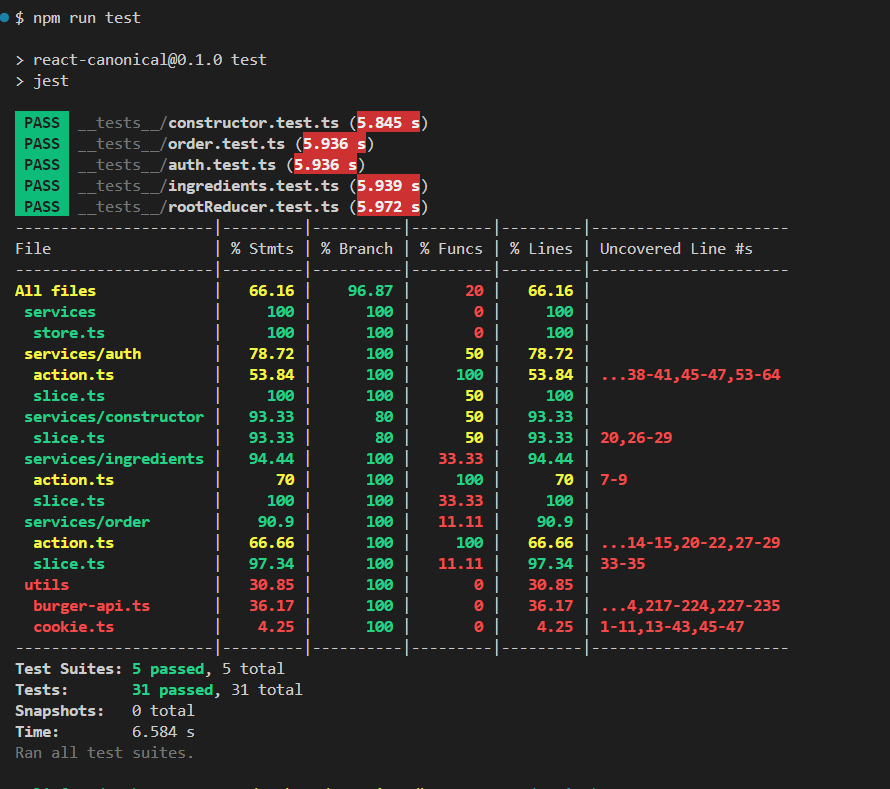

# Тестирование React приложения 

## Настроено тестирование приложения

- [x] В проект добавлены и настроены библиотеки Cypress и Jest.
- [x] Тесты, относящиеся к проверке одной функциональности, объединены блоком describe. В нём описано, что проверяет этот набор тестов.
- [x] Все тесты написаны на TypeScript.
- [x] Все тесты завершаются успешно.

### Тесты на Cypress
- [x] Написаны тесты, проверяющие следующую функциональность:
- Добавление ингредиента из списка ингредиентов в конструктор.
- Открытие и закрытие модального окна с описанием ингредиента.
- Отображение в открытом модальном окне данных именно того ингредиента, по которому произошел клик.
- Процесс создания заказа: добавление ингредиентов в конструктор бургера, проверка отображения модального окна с верным номером заказа при клике на кнопку оформления заказа. Проверка очистки конструктора бургера от добавленных ингредиентов.
В папке cypress/fixtures созданы файлы с данными ответов на запросы, которые используются для подмены запросов к реальному бэкенду.
Настроен перехват с помощью cy.intercept всех запросов к бэкенду, выполняемых во время запуска тестов.
Перед выполнением теста создания заказа в localStorage и сookie подставляются фейковые токены авторизации, а после завершения теста они очищаются.

### Тесты на Jest:
Файлы Jest тестов находятся в отдельной папке __tests__.
- [x] Написан тест, проверяющий правильную настройку и работу rootReducer: вызов rootReducer с undefined состоянием и экшеном, который не обрабатывается ни одним редьюсером (например, { type: 'UNKNOWN_ACTION' }), возвращает корректное начальное состояние хранилища.
- [x] Написаны тесты, проверяющие работу редьюсера конструктора бургера при обработке экшенов добавления и удаления ингредиента.
- [x] Написаны тесты, проверяющие обработку редьюсером экшенов генерируемых при выполнении асинхронного запроса: экшены начала запроса, успешного выполнения запроса и ошибки запроса.

